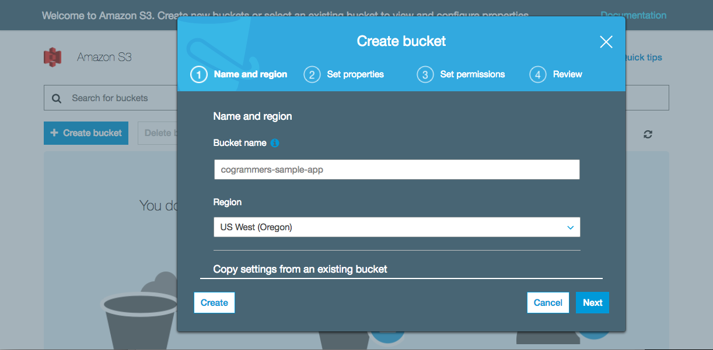
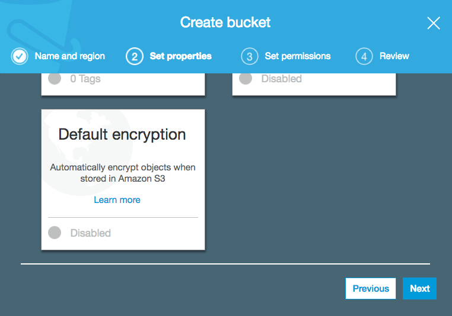
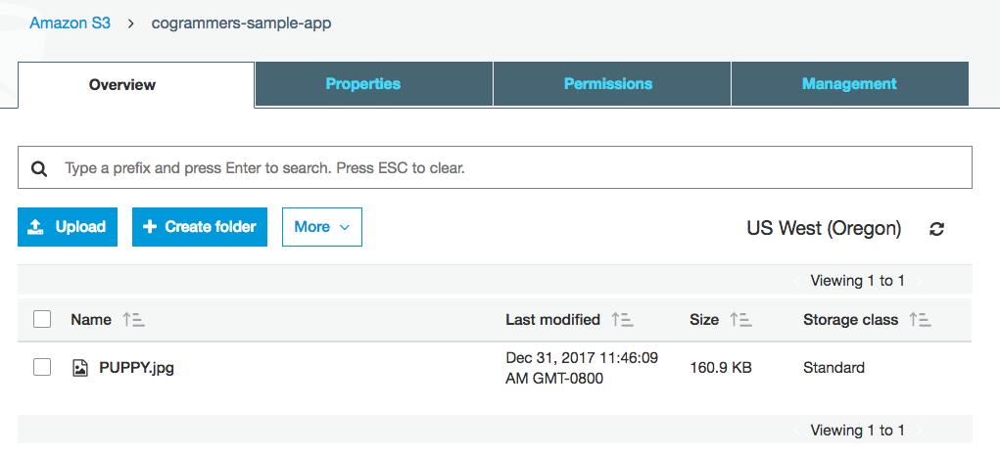

# S3 (Or, Simple Storage Service)

### Let’s start with the basics. What is S3? What are its primary functions? How is it used in apps deployed on AWS?
As its name implies, S3’s primary function is storage. In the context of a web app, an S3 acts as a storage facility for any kind of data in any format you might need for your website (e.g. image files, text files, CSS files, datasets). In addition to simply storing data, S3 can also be used as a powerful tool for data analytics. 

S3 is also not restricted to just one EC2 instance -- depending on the permissions you set for your S3 bucket, you can access its contents from multiple instances. 

An S3 instance is made up by four general parts:
* __Bucket__: a specific S3 instance (the container you store your files in)
* __Objects__:  data ‘items’
* __Keys__: an object’s name
* __Values__: the content of the object

S3 is useful because of its inherent scalability and pay-for-what-you-use pricing structure (as are many other AWS services). These two features make S3 accessible to almost everyone, from the individual developer building a personal app to a corporation running a massive website (e.g. the Amazon website). As your storage needs grow, your price increases accordingly. 

As S3 is a cloud-based tool, it offers many of the advantages afforded to services running in the cloud. One of the most important of these features (in addition to scalability) is reliability. Any data added to an S3 bucket is automatically copied to at least 3 physical, geographically-separated AWS storage facilities -- a safeguard to protect users’ data in the case of an unexpected failure.

S3 is a critical component of many companies’ software infrastructure. To provide a few examples:
* __Netflix__: data lake for big data analytics
* __Airbnb__: backup data, user pictures
* __The Weather Channel__: weather data from hundreds of sources

Later, we’ll touch on another service offered by AWS, managed relational databases (‘RDS’). While the main functions of S3 and RDS are similar (i.e. storing data), the two differ in how they store data. Like its name, S3 is just a ‘bucket’ where a user can essentially ‘dump’ any data they want into it, while RDS acts as an actual SQL-like database, allowing the user to maintain relationships between tables of data.

**What we’ll be using: AWS Free Tier**
AWS’ free tier provides us with 5GB of storage and the ability to send 20,000 GET and 2,000 PUT requests -- more than enough to serve a demo app!

### All right, let’s do this!
We have the option of setting up our buckets either from our web console or the command line. We’ll be using the web console option today.

Log into your AWS account and open up your developer console (https://console.aws.amazon.com). Type ‘S3’ into the search bar and select `S3`. 

Once you’ve navigated to your S3 dashboard, click the blue `Create Bucket` button on the top left-hand corner. Enter a name for your new bucket (think of the bucket’s name like you would a web address), select your preferred AWS region (`US-East` or `US-West`), and click `Next`. Easy!

Now, you’ll see a number of ‘properties’ available for your bucket. We won’t be using any of them today in the tutorial, but do take a look at the `Default Encryption` property near the bottom of the list. One cool thing about S3 is that you can choose to have your data automatically encrypted upon upload for security. Let's skip this for now and click `Next`. 

We now have the opportunity to set specific permissions for our bucket. Again, we’re not going to worry about security details today, so keep the default settings and click `Next`. Finally, we review our bucket’s settings. Once you’ve done so, click `Create Bucket`.

**You’ve created your first bucket! Congratulations!**

### Using our Bucket
Now that we’ve set up our bucket, we can start using it! Back in your S3 console, click your new bucket. You’ll be brought to that bucket’s page, which should currently look like this:

Since we haven’t uploaded anything to our bucket yet, it should be empty. Click the Upload button in the top-left corner to add your first file (aka ‘Object’). When the `Upload` window opens, select the file you wish to add to your bucket. Click `Upload`, and then `Next`.

Like when we first created our bucket, we’ll be given the options to set permissions on our new object, enable data encryption, and add tags, among other properties. Keep the default settings and click `Next` until you get to the final `Review` page. If everything looks good, click `Upload`. You’ll be brought back to your bucket’s home screen, where you should see your uploaded file. 

Congratulations! You’ve added your first object!

Now that we’ve added our file to our bucket, let’s try downloading it. This step is pretty easy -- click the checkbox next to your file and select Download. Your download should start immediately.

Pretty easy, huh?
